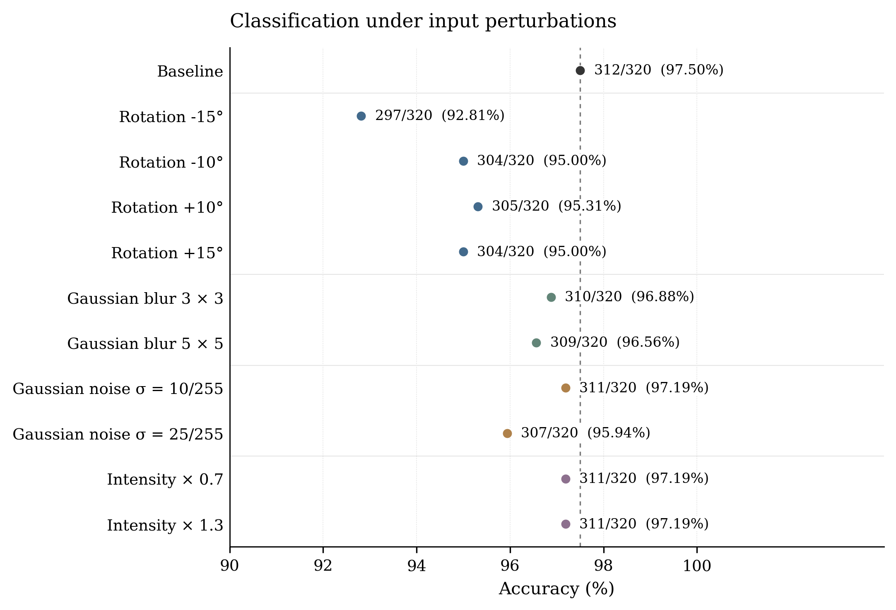

# Level 2 手写数字验证

成员 G 的自采数据、预处理和 LeNet-5 鲁棒性实验。使用组内提供的 TXT 权重推理，模型定义见 `work/model.py`。

20 张整页照片共提取 320 个数字，0–9 每类 32 个。基准识别正确 312 个，准确率为 **97.50%**。另有 10 组单因素扰动和 65 个合成无目标输入。所有预测、错误图片和统计表均保留在 `results/`。

## 目录

```text
level2/
├── data/
│   ├── raw/                    # dataset 正式照片；example 混合数字示例
│   ├── preprocessed/           # 分格、ROI、28×28、32×32 和归一化数组
│   └── robustness/             # 按扰动类型和参数存放输入
├── model/                      # TXT 权重、参考输入和逐层输出
├── src/
│   ├── preprocess.py
│   └── generate_robustness.py
├── work/
│   ├── model.py                # 组内提供的模型与训练代码
│   ├── evaluate.py             # 单组数据评估
│   ├── evaluate_robustness.py  # 扰动批量评估
│   └── plot_results.py         # 从结果表重绘图表
├── tests/test_model_reference.py
├── scripts/python_env.sh      # macOS 启动脚本的环境查找
├── results/
│   ├── baseline/               # 自采基准结果
│   ├── robustness/
│   │   ├── rotation/、blur/、noise/、brightness/、blank/
│   │   ├── figures/            # PNG、PDF、SVG
│   │   ├── predictions.csv
│   │   ├── accuracy_summary.csv
│   │   ├── blank_summary.csv
│   │   └── run_meta.json
│   └── model_reference_test/   # CPU/MPS 单样本逐层对比
└── README.md
```

## 环境与运行

在 `level2` 目录内运行以下命令。本机使用 Python 3.12、Conda 环境 `xgb_env`。环境已配置时直接激活即可；新环境通过 `requirements.txt` 安装依赖。PyTorch 与 torchvision 由安装器选择相互兼容的版本；本次保存的结果使用 PyTorch 2.8.0。

```bash
conda activate xgb_env
# 新环境需要安装依赖时执行
python -m pip install -r requirements.txt
```

项目中的 `.command` 是 macOS 双击入口，按脚本位置确定项目目录，在常见 Conda 安装位置查找 `xgb_env`。特殊安装位置可以通过 `PYTHON_BIN` 指定解释器。Python 脚本也可在终端单独运行。

### 1. 预处理

正式照片放在 `data/raw/dataset/`，命名为 `0_01.jpg`、`0_02.jpg`，依次到 `9_02.jpg`。每页 4 行 × 4 列，整页写同一个数字；标签来自文件名前缀。原始照片保留，新增批次写入新目录。

```bash
python src/preprocess.py data/raw/dataset --output data/preprocessed/dataset_new
```

预处理过程：纸面定位和透视校正 → 等分格子 → 局部背景校正和笔迹提取 → 保持比例缩放到长边 20 像素 → 按亮度重心居中到 28×28 → 四周补 2 像素 → 归一化。

```text
input = (pixel / 255.0 - 0.1307) / 0.3081
```

补零发生在归一化之前，因此归一化数组的边框约为 −0.4242。模型输入为 `(32, 32)` 的 FP32 数组。`preprocess_manifest.csv` 记录样本 ID、原图、行列位置和产物路径。检查 `review/` 中的分格与笔迹预览，确认数字完整。

`example` 是 16 个混合数字的流程示例，不计入正式准确率。它的标签顺序是 `0,1,2,3,4,5,6,7,8,9,0,1,2,3,4,5`，可用 `示例预处理.command` 重现。

### 2. 基准推理

```bash
python work/evaluate.py \
  --input data/preprocessed/dataset/normalized_32x32 \
  --outdir results/baseline/new_run \
  --device mps
```

`--device cpu` 使用 CPU；`auto` 在 MPS 可用时选 MPS。当前保存的基准结果在 `results/baseline/`。基准报告记录设备为 MPS；此前 CPU 复算的 320 个预测类别与之相同。

### 3. 扰动生成与评估

```bash
python src/generate_robustness.py --output data/robustness_new
python work/evaluate_robustness.py \
  --robustness-root data/robustness_new \
  --output results/robustness_new \
  --device mps
```

也可以双击 `生成扰动数据.command`、`批量鲁棒性评估.command`。批量评估入口默认读取已保留的 `data/robustness/`，使用 MPS；要评估新生成的目录，请使用上面的 `--robustness-root` 参数。已有结果不会被批量入口覆盖。

`robustness_manifest.csv` 中的 `source_sample_id` 对应基准样本，10 个扰动组各有 320 张。每次只修改标准 28×28 图上的一个因素，再补零、归一化。噪声使用种子 `20260907`，强度分别为像素值标准差 10 和 25。亮度实验是对黑底数字图乘系数并截断到 `[0, 255]`，衡量模型对输入强度的敏感性，不等同于重新拍摄时的光照变化。

### 4. 重绘图表

```bash
python work/plot_results.py --results results/robustness
```

绘图只读取现有 CSV，不重新推理。每张图导出 300 dpi PNG、PDF 和 SVG；PDF/SVG 可用于报告排版。准确率点图和旋转图使用局部坐标范围显示差异，图中标有实际刻度。当前是固定数据、单次评估，未绘制多次运行误差条。

## 结果

| 条件 | 参数 | 正确数 / 样本数 | 准确率 |
| --- | --- | ---: | ---: |
| 基准 | 无扰动 | 312 / 320 | 97.50% |
| 旋转 | −15° | 297 / 320 | 92.81% |
| 旋转 | −10° | 304 / 320 | 95.00% |
| 旋转 | +10° | 305 / 320 | 95.31% |
| 旋转 | +15° | 304 / 320 | 95.00% |
| 高斯模糊 | 3×3 | 310 / 320 | 96.88% |
| 高斯模糊 | 5×5 | 309 / 320 | 96.56% |
| 高斯噪声 | σ = 10/255 | 311 / 320 | 97.19% |
| 高斯噪声 | σ = 25/255 | 307 / 320 | 95.94% |
| 输入强度 | 0.7× | 311 / 320 | 97.19% |
| 输入强度 | 1.3× | 311 / 320 | 97.19% |



当前扰动结果由 CPU 计算，设备记录见 `results/robustness/run_meta.json`。−15° 旋转相对基准下降 4.69 个百分点，在这些参数中影响最大。320 个样本来自同一批书写和拍照条件，3,200 张扰动图是其派生样本，不能视为 3,200 个独立采集样本。

无目标输入包括纯空白 1 张、合成阴影 32 张和合成杂乱纹理 32 张。模型只有 0–9 十个输出，因此 argmax 总会给出一个数字；`predicted_digit_count` 不是已部署系统的误报率。纯空白最高类别置信度约 11.0%，杂乱纹理平均约 64.5%，最高约 99.89%。目前尚未设计拒识阈值，也没有用真实空白照片验证整个预处理流程。

| 文件 | 内容 |
| --- | --- |
| `results/baseline/predictions.csv` | 320 个基准样本的标签、预测、置信度和 logits |
| `results/robustness/predictions.csv` | 3,200 个扰动样本及 65 个无目标样本 |
| `results/robustness/accuracy_summary.csv` | 基准与 10 组扰动的正确数、样本数和准确率 |
| `results/robustness/blank_summary.csv` | 无目标样本的类别分布和置信度，单独统计 |
| 各组的 `error_cases.csv`、`error_cases*.png` | 错误样本及基准图、扰动图、模型输入对照 |

发布目录中的记录已将项目内绝对路径改为相对 `level2/` 的路径；预处理清单中原有的产物相对路径仍以清单所在目录为基准。历史运行报告保留原设备与精度信息。

基准错误集中于 2、3、6、9。错误图片完整保留；查看数据质量时应同时检查对应的原始单格图。没有按预测结果删除或修改标签。

## 模型参考验证

```bash
python tests/test_model_reference.py --device cpu
python tests/test_model_reference.py --device mps
```

模型共有 61,470 个参数，直接加载五份 TXT 权重即可推理，不需要先转换为 PTH。单样本逐层对比中，Conv1/Pool1 通过，Conv2 之后仍有数值差异，CPU/MPS 均预测为 7。现有报告保留该未通过状态；它与自采分类准确率是不同的检查。

训练资料使用 `Resize((32,32))`，本实验按任务指南使用 28×28 补零。与 C/E 联合验证前仍需统一这项输入约定及参考精度。`work/model.py` 作为收到的模型资料保留；评估脚本只导入模型类，不执行训练入口。

## 工作进度

更新日期：2026-09-07。

已完成：

- [x] 采集 20 张正式照片，提取 320 个数字，每类 32 个。
- [x] 保留原图、分格、ROI、28×28、32×32 和归一化输入，建立样本对应表。
- [x] 完成 CPU/MPS 单样本参考对比并记录差异。
- [x] 完成自采基准推理，保存 8 个错误案例。
- [x] 生成 10 组单因素扰动和 65 个合成无目标输入。
- [x] 完成扰动批量推理，核对逐样本表、汇总表及错误案例。
- [x] 整理报告图表、可复现命令和分层结果目录。

待完成：

- [ ] 获取或复算同一模型的 MNIST 测试集准确率，注明输入处理方式。
- [ ] 明确定义“未作标准预处理的自采图”对照组，并与当前基准比较。
- [ ] 补充真实无目标照片，验证预处理及模型的端到端行为。
- [ ] 与 B/C 确认补零与 Resize 的输入约定，以及逐层参考数据的精度设置。
- [ ] 从正确、错误和困难样本中选 10–20 张交 C/E，完成 HLS/RTL 对比。
- [ ] 补齐预处理流程图、MNIST 对比图及典型正确样本，完成个人实验报告。
- [ ] 与 A/H 核对交付要求，整理最终提交材料。
